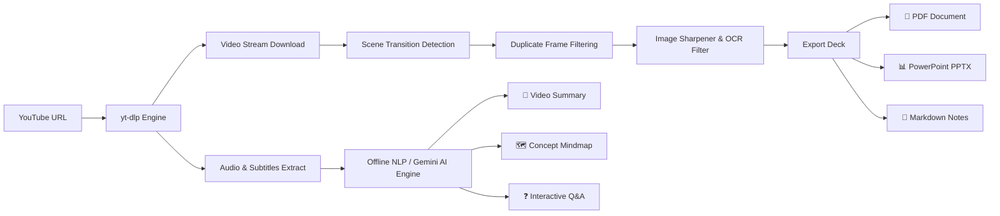

<div align="center">

# 🎬 YT Extractor Pro Ultimate

**Intelligent YouTube Slide Extractor, High-Res Media Downloader & AI Study Assistant**

[](https://python.org)
[](https://fastapi.tiangolo.com)
[](https://github.com/yt-dlp/yt-dlp)
[](https://docker.com)
[](LICENSE)

<p align="center">
  A high-performance desktop and web application built with <strong>FastAPI, Tailwind CSS, PyWebView, and yt-dlp</strong>. Extract high-quality presentation slides from video lectures, download up to 4K video/320kbps MP3s, generate AI video summaries & concept mindmaps, and export study materials to PDF & PPTX.
</p>

</div>

---

## 📌 Table of Contents
- [Architecture & Workflow](#-architecture--workflow)
- [Key Features](#-key-features)
- [Tech Stack](#-tech-stack)
- [Prerequisites](#-prerequisites)
- [Local Installation](#-local-installation)
- [Docker & Cloud Deployment](#-docker--cloud-deployment)
- [Configuration (.env)](#-configuration-env)
- [License](#-license)

---

## 🏗️ Architecture & Workflow



---

## ✨ Key Features

### 1. 🎞️ Slide Scene Extraction & Enhancement
- **Smart Scene Detection**: Detects slide changes automatically without capturing duplicate intermediate transition frames.
- **Image Enhancer & Text Sharpening**: Built-in 1-click filter (`ImageEnhance.Contrast` + `ImageEnhance.Sharpness`) that cleans blurry webcam/recording artifacts to make text crystal clear.
- **Multi-Format Export**: Export cleaned slides directly to:
  - 📄 **PDF Presentation** (with custom branded title cover page).
  - 📊 **PowerPoint Presentation (`.pptx`)**.
  - 📦 **Zipped JPG/PNG Images**.

### 2. ⚡ Direct Video & Audio Downloader (`yt-dlp`)
- **Resolution Selector**: Download up to **4K (2160p)**, **2K (1440p)**, **1080p FHD**, **720p HD**, **480p**, and **360p**.
- **Audio Bitrate Selector**: High-fidelity MP3 extraction at **320 kbps**, **256 kbps**, **192 kbps**, and **128 kbps**.
- **Subtitle Extractor**: Download synchronized `.srt` / `.vtt` subtitles.

### 3. 🧠 AI Study Assistant & Dual NLP Engine
- **Engine Selector**: Switch seamlessly between **⚡ Free Offline NLP (No API Key Required)** and **🤖 Google Gemini AI**.
- **Interactive Concept Mindmaps**: Generates visual Mermaid.js mindmaps breaking down core video topics.
- **Video Q&A with Timestamp Seeking**: Interactive timestamp buttons (e.g., `⏱️ 02:45`) that immediately jump the video player to that moment.
- **Interactive 3D Study Flashcards**: Flip-card memory testing mode with real-time score tracking.

### 4. 🏷️ Study Tags & Categorization
- Tag slides with color-coded markers (🔴 *Exam Alert*, 🟢 *Definition*, 🔵 *Code Snippet*, 🟡 *Key Concept*).
- Star favorite slides to create targeted quick-revision decks.

---

## 🛠️ Tech Stack

- **Backend:** [FastAPI](https://fastapi.tiangolo.com/), [Uvicorn](https://www.uvicorn.org/), Python 3.9+
- **Media Engine:** [yt-dlp](https://github.com/yt-dlp/yt-dlp), [FFmpeg](https://ffmpeg.org/)
- **Image & Slide Processing:** [Pillow (PIL)](https://python-pillow.org/), [python-pptx](https://python-pptx.readthedocs.io/), [pytesseract OCR](https://github.com/madmaze/pytesseract)
- **Frontend / UI:** [Tailwind CSS](https://tailwindcss.com/), [PyWebView](https://pywebview.flowrl.com/), [Mermaid.js](https://mermaid.js.org/)
- **AI / NLP:** Google Gemini API / Local Heuristic NLP

---

## 📦 Prerequisites

1. **Python 3.9 or higher** installed.
2. **FFmpeg**:
   - **Windows:** Auto-downloaded automatically on first run if not found in PATH!
   - **Linux / Ubuntu:** `sudo apt-get install ffmpeg`
   - **macOS:** `brew install ffmpeg`
3. *(Optional)* **Tesseract OCR** for text extraction from slides:
   - Ubuntu: `sudo apt-get install tesseract-ocr`
   - Windows: Download from [UB-Mannheim Tesseract](https://github.com/UB-Mannheim/tesseract/wiki).

---

## 🚀 Local Installation

### 1. Clone Repository
```bash
git clone https://github.com/Ayush8512/Youtube_Slide_Extractor.git
cd Youtube_Slide_Extractor
```

### 2. Set Up Virtual Environment (Recommended)
```bash
# Windows
python -m venv venv
venv\Scripts\activate

# Linux / macOS
python3 -m venv venv
source venv/bin/activate
```

### 3. Install Dependencies
```bash
pip install -r requirements.txt
```

### 4. Run the Application
**Method A — Run via Python:**
```bash
python app.py
```

**Method B — Run via Windows Batch Script:**
Double-click `Yt_Slide_Extractor.bat` in the project root.

Navigate to **`http://127.0.0.1:8000`** in your browser (or it will automatically launch as a standalone desktop window via PyWebView).

---

## 🐳 Docker & Cloud Deployment

A production-ready Dockerfile and `render.yaml` are included for 1-click deployments:

### Build & Run with Docker:
```bash
docker build -t yt-slide-extractor .
docker run -p 7860:7860 yt-slide-extractor
```
Open **`http://localhost:7860`**.

*Works out-of-the-box on Hugging Face Spaces (Docker SDK) and Render.com Web Services.*

---

## ⚙️ Configuration (.env)

Create a `.env` file in the root directory (refer to `.env.example`):

```ini
# Optional: Needed only if you wish to use the Gemini AI Engine instead of the Free Offline NLP engine
GEMINI_API_KEY=your_gemini_api_key_here

# Server Port (Default: 8000)
PORT=8000
```

---

## 📄 License
This project is licensed under the **MIT License** - see the [LICENSE](LICENSE) file for details.

---

## 👤 Author
**Ayush Pandey**
- GitHub: [@Ayush8512](https://github.com/Ayush8512)
- LinkedIn: [Connect on LinkedIn](https://linkedin.com)
